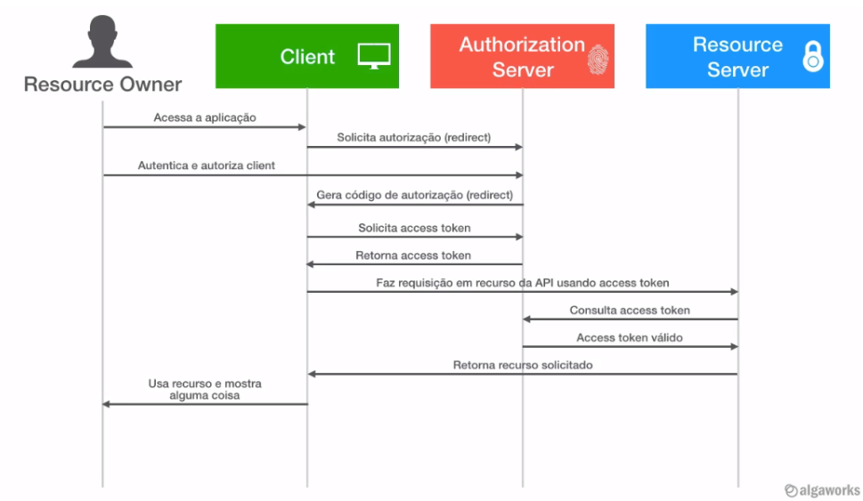

# Especialista Spring Rest


Curso Especialista Spring da AlgaWorks. <br>
Pastas:
 - food-api: API principal de exploração das funcionalidades
 - client: Consumidor JavaScript da API principal (food-api)
 - food-java-client: Consumidor Java da API principal (food-api)

## Capítulo 2 - Spring e Injeção de Dependências

[Injeção de dependências](https://blog.algaworks.com/injecao-de-dependencias-com-spring/) é um tipo de inversão de controle (ou Inversion of Control – IoC) que dá nome ao processo de prover instâncias de classes que um objeto precisa para funcionar.
Dessa forma é possível programar voltados para interfaces e, com isso, manter o baixo acoplamento entre as classes de um mesmo projeto.
Baixo acoplamento: componentes de um sistema são interconectados de modo que um dependa do outro o mínimo possível.

#### @Component
Notifica que a classe é um Bean gerenciado pelo Spring. Durante a varredura de componentes, o bootstrap da aplicação, o Spring Framework detecta automaticamente as classes anotadas com @Component e as instancia.
Por padrão, as instâncias de bean desta classe têm o mesmo nome que o nome da classe com uma inicial minúscula.
@Repository , @Service , @Configuration e @Controller são todas meta-anotações de @Component.

#### @Controller
`@Controller`também é um componente gerenciado pelo Spring, no caso, que responde requisições Web.
Essa anotação de nível de classe informa ao Spring Framework que essa classe serve como um controlador no Spring MVC.

#### @Retention
Usamos a anotação `@Retention` para dizer em que parte do ciclo de vida do programa nossa anotação se aplica.
Para fazer isso, precisamos configurar @Retention com uma das três políticas de retenção:

```java
RetentionPolicy.SOURCE - visível nem pelo compilador nem pelo tempo de execução
RetentionPolicy.CLASS - visível pelo compilador
RetentionPolicy.RUNTIME - visível pelo compilador e pelo tempo de execução
```

#### @Profile
Permite mapear beans para diferentes perfis. Considere um cenário básico: temos um bean que deve estar ativo apenas durante o desenvolvimento, mas não implantado na produção. Apenas Beans anotados com `@Profile("dev")` seriam instanciados caso esteja configurado o perfil de desenvolvimento em application.properties `spring.profiles.active=dev`.

#### @Bean
No Spring, os objetos que formam o backbone de seu aplicativo e que são gerenciados pelo contêiner Spring IoC são chamados de beans. Um bean é um objeto instanciado, montado e gerenciado de outra forma por um contêiner Spring IoC (Inversion of Control).

#### @Configuration
As classes de configuração podem conter métodos de definição de bean anotados com `@Bean`.

#### Ciclo de vida dos Beans
Inicialização, execução, destruição. Após contrutor e importações é chamado o init (`@PostConstructor`).

#### Propriedades
- Substituindo propriedades via linha de comando, por exemplo:
`java -jar target/food-api.jar --server.port=8081`
- Substituindo variáveis por variável de ambiente:

	- `EXPORT SERVER_PORT=8082` (macOs)
	- `set SERVER_PORT=8081
		echo %SERVER_PORT%`(Windows)
- Ativando o Spring Profile por linha de comando:
`java -jar target/food-api.jar --spring.profiles.active=development`
- Ativando o Spring Profile por variável de ambiente:
	- `set SPRING_PROFILES_ACTIVE=production` (Windows)

#### @ConfigurationProperties
Essa anotação auxilia na configuração externalizada e facilita acesso às propriedades definidas nos arquivos de propriedades
O Spring vinculará automaticamente qualquer propriedade definida em nosso arquivo de propriedade que tenha o prefixo "notificador.email" e o mesmo nome de um dos campos na classe `NotificadorProperties`.

## Capítulo 3 - Introdução ao JPA e Hibernate

#### EntityManager
EntityManager é uma parte da Java Persistence API. Principalmente, ele implementa as interfaces de programação e regras de ciclo de vida definidas pela especificação JPA 2.0.

#### @Transactional
Podemos anotar um bean com @Transactional no nível da classe ou do método. A anotação também oferece suporte a outras configurações:

- o tipo de propagação da transação
- o nível de isolamento da transação
- um tempo limite para a operação envolvida pela transação
- um sinalizador readOnly - uma dica para o provedor de persistência de que a transação deve ser somente leitura
- as regras de reversão para a transação
Observe que - por padrão, a reversão acontece para o tempo de execução, exceções não verificadas apenas. A exceção verificada não dispara um rollback da transação.

#### Estados de uma entidade
Uma entidade pode assumir alguns estados com relação ao EntityManager. Os estados podem ser:

- Novo (new ou transient)
- Gerenciado (managed) - através dos métodos `persist`, `merge` ou buscar a entidade usando o EntityManager
- Removido (removed) - método `remove`
- Desanexado (detached) - método `detach`

Observar que não é possível um objeto em estado *transient* ir direto para o estado *removed*. Por isso a entidade foi buscada, para ficar em estado gerenciado, e só após isso é chamado o método *removed*.


#### Padrão DDD - Domain-Driven Design
Design Orientado a Domínio representa um grupo de objetos de domínio que podem ser tratados como uma única unidade. Um exemplo pode ser um pedido e seus itens de pedido, eles serão objetos separados, mas é útil tratar o pedido (junto com seus itens de linha) como um único agregado.
<https://martinfowler.com/bliki/DDD_Aggregate.html>

Não se deve criar repositórios para entidades que não são agregate root, no exemplo o agregate root é o pedido.

#### Dialeto SQL
 Ao inserir relacionamento entre entidades é necessário inserir o dialeto para que o hibernate adicione a *foreign key* ao criar a coluna anotada com o relacionamento: `spring.jpa.properties.hibernate.dialect=org.hibernate.dialect.MySQL8Dialect`.

#### Propriedade nullable de @Column e @JoinColumn
Indica que ao criar tabela através da aplicação, os campos serão ou não anuláveis no banco de dados.

## Capítulo 4 - REST com Spring

#### Constraints do REST
 - Cliente-servidor
 - Stateless
 - Cache
 - Interface uniforme
 - Sistema em camadas
 - Código sob demanda

#### REST *vs* RESTful
REST é o estilo arquitetural que segue as constraints do REST, é a especificação. RESTful é uma API desenvolvida em conformidade com as constraints REST.

#### Recursos REST

Coisas expostas na web, possui importância para ser referenciado como uma coisa no software. Pode ser Singleton (representa uma única coisa) ou Collection.
Rest usa URIs(Uniform Resource Identifier) para identificar um recurso.

URI vs URL -  URL (Uniform Resource Locator) é um tipo de URI, especifica a localização do recurso (com protocolo por exemplo). Ex.: https://market.com.br/produtos. O plural é consenso de utilização.
URI deve referenciar à alguma coisa, um substantivo e não a um verbo ou ação, coisas possuem propriedades, verbos não.

#### @ResponseBody
A resposta do método deve ser enviada como resposta da requisição HTTP. `@RestController`engloba as anotations _@Controller_ e _@ResponseBody_.

#### Negociação de conteúdo
Para realização de content negotiation o cliente afirma qual formato de conteúdo ele aceita através do cabeçalho `Accept` com um MediaType, por exemplo application/json, application/xml, etc.

Ao adicionar dependência jackson a api passa a responder as requisições tanto com json quanto com xml.
```xml
<dependency>
	<groupId>com.fasterxml.jackson.dataformat</groupId>
	<artifactId>jackson-dataformat-xml</artifactId>
</dependency>
```
Ao definir o *MediaType* em um método específico, este passa a responder apenas o tipo configurado, respondendo com `406 Not Acceptable`. Também é possível definir qual método é chamado a partir do tipo de negociação de conteúdo.
`@GetMapping(produces = { MediaType.APPLICATION_JSON_VALUE, MediaType.APPLICATION_XML_VALUE })`

 - Status HTTP para collection resource vazia: 200
 - Status HTTP para singleton resource inexistente: 404. Indica erro do cliente, por exemplo a url `cozinhas/9999` não retorna nenhum recurso, "não existe", já `cozinhas/2` existe.

#### SerialVersionUID
Ele é o recurso que usamos para dizer ao Java que um objeto serializado é compatível ou não com o .class utilizado para desserializar.
Dentro da [especificação](https://docs.oracle.com/javase/8/docs/platform/serialization/spec/class.html#a4100) existe uma nota recomendando que os desenvolvedores declarem a propriedade explicitamente para evitar problemas de desserialização.

## Capítulo 5 - Spring Data JPA
JPQL é a linguagem de consultas do JPA.

#### Keywords e Query Methods
Mecanismo de criação de queries por meio de palavras chave: Distinct, And, Or, Containing, Between, OrderBy, Null, After, etc.
[Documentação do Spring Data JPA:Keywords de querymethods](https://docs.spring.io/spring-data/jpa/docs/current/reference/html/#jpa.query-methods.query-creation)

Deve começar por "find", mas pode começar também por "read", "get", "Query" ou "stream".
 - Prefixos de query methods: *count, top, first, exists*, etc.

#### Criteria
`CriteriaQuery` é responsável por criar a estrutura de uma query, a composição das cláusulas.
`CriteriaBuilder` funciona como uma fábrica que contrói elementos para a construção da consulta.
Não vale a pena ser utilizada para consultas simples por ser mais verbosa e demandar mais esforço programático.

#### Specification
Filtros são as *specifications* de forma mais isolada, de modo que podem ser combinados.
Ponto negativo, possibilidade de usar o mesmo specification em vários lugares, caso seja necessária alguma alteração, a implementação seria ajustada em vários locais do código. Possível solução, isolar a combinação de specifications em um método na classe RepositoryImpl.

#### Customizando o repositório Base
Estendendo *JpaRepository*, utilizando *Generics*, importando *EntityManager* é possível criar um repositório base customizado, com os métodos do JPA e outros mais.
Necessário inserir a anotação na classe main:

`@EnableJpaRepositories(repositoryBaseClass = CustomJpaRepositoryImpl.class)`

## Capítulo 6 - JPA e Hibernate

#### @Embeddable
JPA fornece a  anotação @Embeddable para declarar que uma classe será integrada por outras entidades.

```java
@Embeddable // Entidade incorporável
public class Endereco {
```

#### @Embedded
A anotação JPA @Embedded é usada para embutir um tipo em outra entidade. Incorporando para uma única tabela de banco de dados, no exemplo em *tb_restaurante*.

```java
public class Restaurante {
	//...

	@Embedded
	private Endereco endereco;
```
#### @CreationTimestamp
Marca uma propriedade como o carimbo de data/hora ao salvar a entidade pela primeira vez. Anotação da implementação Hibernate.

#### @UpdateTimestamp
Marca uma propriedade como o carimbo de data/hora ao atualizar uma entidade. Anotação da implementação Hibernate. O próprio Hibrenate insere o valor do atibuto.

#### Eager Loading
Carregamento "ansioso", antecipado. Todas as associações terminados em _"ToOne"_ utilizam a estratégia `Eager Loading`. Ainda com @JsonIgnore o select de entidade mappeada é realizado, por exemplo ao buscar um restaurante específico, é feito select de cozinhas realizadas, por causa da estratégia EagerLoading. Ou seja, quando uma entidade é carregada no banco de dados as entidades associadas a ela também serão carregadas.
Não significa que a associação Eager será feita em um select apenas através _joins_, pode gerar vários selects. "Problema" "n+1", uma busca na verdade origina mais *n* consultas.

Para melhorar a performance e evitar consultas desnecessárias, é possível utilizar `@ManyToOne(fetch = FetchType.LAZY)` na propriedade do objeto ou `fetch join` apenas na query JPQL. A query pode gerar um produto cartesiano com mais tuplas por causa do join, porém o jpa faz a correspondência para evitar duplicações.

```
	@Query("from Restaurante r join fetch r.cozinha")
	List<Restaurante> findAll();
```


#### Lazy Loading
Carregamento preguiçoso. Todas as associações terminados em _"ToMany"_ utilizam a estratégia `Lazy Loading`. Não realiza consultas de entidade associadas sem que algum método dessa entidade seja explicitamente chamado.
Sem o `@JsonIgnore` é preciso analisar pois a consulta da entidade provalvelmente será realizada carregando os abjetos associados, apenas não estaria serializando para json no retorno das requisições.

## Capítulo 7 - Pool de conexões e Flyway

`spring.jpa.hibernate.ddl-auto=update` cria uma coluna, porém alterações posteriores, como nullable, alteração do nome da coluna não são realizadas pois não garantem a manutenão do funcionamento da aplicação, logo `Schema generation` em produção não é uma boa prática. O próprio Hibernate [afirma](https://docs.jboss.org/hibernate/orm/5.2/userguide/html_single/Hibernate_User_Guide.html#schema-generation).

> Embora a geração automática de esquema seja muito útil para fins de teste e prototipagem, em um ambiente de produção, é muito mais flexível gerenciar o esquema usando scripts de migração incremental.

#### Flyway
Necessário inserir arquivos *sql* na pasta `resources/db/migration` com nome de versão, podendo ter pontos, underlines ou data hora, iniciando por V maiúsculo, por exemplo: V1.0.sql, V1_0.sql, V001__descricao.sql, V20212801.
É criada a tabela `flyway_schema_history` com auditoria de alterações.

As alterações são incrementais, da versão 1 para a 4, são necessários executar a v2, em seguida v3 e só após a v4. Deve ser evitado inserir inserts de dados de teste em *migrations* para evitar que estes valores entrem em produção.

Passos sugeridos, criar arquivo .sql dentro da pasta *db/migration* apenas com uma descrição, como "cria-tabela-usuario.sql". Em seguida inserir os comandos sql no arquivo, e então renomear inserindo a versão, com V maiúsculo e número da versão.
Verifica a inalteração de versão arquivo sql anteriormente adicionado pelo campo *checksum*.

Para alterações maiores em banco sugere-se criar um backup/dump do banco de dados em desenvolvimento. Em seguida escrever o script e executar para verificar o funcionamento, após isso restaurar o backup realizado anteriormente, e copiar os comandos *sql* para o arquivo migration dentro do projeto Spring.
Não se deve inserir dados de teste no banco através de arquivos migration sql.

##### Inserção de dados
Dados de teste podem ser inseridos no banco através do arquivo `afterMigrate.sql`. Ele será executado no callback do Flyway, após executar todas as migrações, na prática sempre que a aplicação for iniciada retornando a um estado conhecido. Podemos inserir este arquivo em pasta específica e indicar ao Flyway a leitura nessa pasta através de propriedade em *application*:

> spring.flyway.locations=classpath:db/migration,classpath:db/testdata

##### Falha
Quando uma migração **falha** ela fica armazenada na tabela de auditoria criada pelo Flyway chamada *flyway_schema_history*, com o valor 0 na coluna "success". Ainda que seja corrigida, o Flyway não permite a aplicação de uma versão já executada. Portanto deve ser observado até onde o arquivo foi executado, essas alterações devem ser desfeitas, o arquivo corrigido e o comportamento (em tese/desenvolvimento) seria deletar essa tupla em *flyway_schema_history*. Corrigir o arquivo sql migration e executar novamente o projeto.

Outra opção para remover a ultima tupla de *flyway_schema_history* seria executar na pasta do projeto o comando `./mvnw flyway:repair -Dflyway.configFiles=src/main/resources/flyway.properties`. Sendo criado o arquivo mencionado com os dados de conexão com o banco. 

*Se você copiar (da raiz do nosso projeto, ou qualquer projeto gerado pelo Spring Initializr) os arquivos mvnw, mvnw.cmd e a pasta .mvn você será capaz de executar os comandos maven de dentro do diretório onde colocou esses arquivos.*

##### Criando migração a partir de DDL gerado por schema generation
Em `application.properties` adicionamos duas propriedades. Elas serão temporárias, após a geração do arquivo serão deletadas.
 - *spring.jpa.properties.javax.persistence.schema-generation.scripts.action=create* para gerar um script sem que este seja executado automaticamente.
 - *spring.jpa.properties.javax.persistence.schema-generation.scripts.create-target=src/main/resources/ddl.sql* para informar o arquivo em que o script dll será armazenado

O comportamento esperado é que o script de geração não seja executado, e seja gerado o arquivo de criação das tabelas. Caso haja arquivo `src/main/resources/import.sql` seu conteúdo também será inserido em comandos no arquivo dll gerado.
Após a captura desse script, faça as devidas revisões e verificações, alteração de nome de foreign keys para um nome mais reconhecível, verificação de length de colunas e demais alterações desejadas.
Observação: `spring.jpa.properties.` utilizado para adicionar propriedades nativas para o provedor do JPA.

## Capítulo 8 - Tratamento e modelagem de erros da API

A anotação `@ResponseStatus(HttpStatus.NO_CONTENT)` acima do método no Controller indica o status http retornado caso não hajam exceções.
Exceção ainda retornada com atributos: "timestamp", "status", "error", "message", "trace".
As classes de domínio não devem ter contato com a camada que se relaciona com a web, os controllers têm essa responsabilidade, como por exemplo inserir código de status de resposta Http.

`ResponseStatusException` indicada para projetos menores, quando se deseja que uma única exceção retorne diferentes status Http, quando não tem possui tempo hábil para criação de exceções customizadas. Com esse objeto ainda não é possível customizar corpo da resposta de exceção, apenas status code e mensagem.
Uma exceção personalizada pode estender `ResponseStatusException`, como vantagem têm-se a possibilidade de enviar diferentes códigos de status Http por quem lança a exception, temos uma exceção que pode retornar diversos status Http. Desvantagem é caso a exceção esteja dentro de uma classe serviço, então o código http seria definido em um pacote que deve conter regras de negócio.

Importante ter um padrão de objeto de resposta de exceções em uma API.

Exemplo de especificações que tentam padronizar o formato de resposta com os detalhes do erro como: jsonapi.org, vnd.error, [Problem Details for Http APIs](https://tools.ietf.org/html/rfc7807) (RFC 7807, IETF). Neste projeto será usado a última especificaçao:

```json
{
    "status": 400,
    "type": "https://foodkamila.combr/recurso-em-uso.",
    "title": "Recurso em uso",
    "detail": "Não foi possível excluir a cozinha de código 8, porque está em uso",
    "instance": "/cozinhas/8/erros/98204983"
}]
```

Propriedade *status* deve ter o mesmo código de status da requisição original gerado pela API. *Type* é uma URI que identifica o tipo do problema, pode ou não ser uma URL acessível pela internet, sendo um a URI que descreve um problema único e como resolvê-lo. *Title* descreve um texto legível para humanos que descreve o erro, deve ser o mesmo para mesmo código de statusHttp de erro.
*Detail* é uma descrição mais detalhada do erro específico legível para humanos. *Instance* é um apropriedade opcional onde conta uma URI exata específica do erro retornado.`

##### Podemos expor detalhes internos do erro, como a stacktrace?
Pode-se adicionar a pilha de erros à resposta por opção de escolha. Porém em APIs públicas, onde terceiros podem acessar, não é recomendado retornar detalhes internos da API, pois essa informação não é útil para o cliente e pode expor dados sensíveis da aplicação para terceiros.


##### Todas as respostas com erros precisam ter um corpo descrevendo o problema?
Não, pois há problemas já bem documentados pelo protocolo Http. Interessante retornar o *status* e *title* pelo menos.

##### Benefícios
Formato único para descrever erros, de forma que o consumidor possa entender o que aconteceu e tomar uma decisão. Facilita a construção e manutenção da API. Caso o cliente utilize mais de uma API, se elas utilizaerem o mesmo padrão de resposta de erro não é necessário tratamentos específicos para compreensão dessa resposta.

Deve-se analisar se a excepção que ocorreu é um subtipo de outra exceção. Caso positivo, deve-se tratar a exceção mais genérica.

## Capítulo 9 - Validações com Bean Validation

A partir da versão 2.3.0 do Spring o Bean Validation não é adicionado automaticamente como dependência do pacote spring-boot-starter-web. Nesse caso é necessário adicionar a dependência do spring-boot-starter-validation no projeto de forma explícita:

```xml
<dependency> 
    <groupId>org.springframework.boot</groupId> 
    <artifactId>spring-boot-starter-validation</artifactId> 
</dependency>
```
Apenas inserindo critério de validação na entidade, está é implementada no repository. Para validar no controller deve ser inserido `@Valid` no objeto recebido no controller.

Lista e documentação de [validações](https://docs.jboss.org/hibernate/stable/validator/reference/en-US/html_single/#section-builtin-constraints).
Por padrão uma entidade não valida outra entidade inserida nela em cascata para isso deve-se colocar a anotação `@Valid` no atributo.
Por padrão a validação utiliza o group `javax.validation.Groups.Default.class`.
Anotação `@ConvertGroup` informa pra entidade modelo que ao validar o atributo anotado, deve-se utilizar o group utilizado. Convertendo de group `Default` para um grupo customizado apenas naquele atributo.

##### Resource Bundle do Bean Validation
Pode-se observar nas dependências do projeto o jar `hibernate-validator`, e o resource bundle `ValidationMessages.properties`. Esse arquivo contém as mensagens relacionadas à validação.
Podemos criar um arquivo de mesmo nome na pasta `resource`do projeto, que será responsável no nosso projeto por resolver as mensagens do *Bean Validator*.

```java
	// Restaurante.class
	@NotNull
	@PositiveOrZero(message = "{TaxaFrete.invalida}")
	@Column(name = "taxa_frete", nullable = false)
	private BigDecimal taxaFrete;
	
	// ValidationMessages.properties
	TaxaFrete.invalida = Taxa frete está inválida. Informe um valor positivo. 
```
Após a resolução da mensagem pelo Bean Validator o Spring percorre seu resource bundle `messages.properties` e sobrescreve a mensagem caso esteja presente no bundle do Spring.

```java
	// messages.properties
	PositiveOrZero={0} deve ser um valor maior ou igual a zero
```
Por possuir precedência, recomenda-se a utilização do arquivo *messages.properties*.

##### Placeholder em Bundle MessagesProperties
Para o placeholder de índice 0  espera-se o valor da propriedade. Em caso de validação de classe não se tem esse dado, pois não se trata de uma propriedade específica.
Os placeholders são atribuídos aos índices em sua ordem alfabética.

##### Validando objeto Map
Ao receber um objeto do tipo `Map` o controlador não é capaz de validá-lo. Para validá-lo é necessário convertê-lo em uma classe anotada com validações, em seguida validá-lo programaticamente utilizando `SmartValidator.validate`.

```java
	BeanPropertyBindingResult bindingResult = new BeanPropertyBindingResult(objetoASerValidado, "nomeDaEntidade");
	org.springframework.validation.SmartValidator.validate(objetoASerValidado, bindingResult);
```

## Capítulo 10 - Testes

### Testes de Integração
Teste de integração deve validar uma única funcionalidade.
Deve possuir três partes: cenário, ação, validação.
É possível executar apenas um método de teste, clicando com o lado direito do mouse, "Run as", "JUnit Test".

```java
	// Exemplo de Teste de Integração
	@Test(expected = ConstraintViolationException.class)
	public void deveFalhar_QuandoCadastroCozinhaSemNome() {
		Cozinha novaCozinha = new Cozinha();
		novaCozinha.setNome(null);
		
		novaCozinha = cadastroCozinhaService.salvar(novaCozinha);
	}
```

##### Nomes de testes
Ideal escolher um padrão para nomes de métodos de teste, e utilizar esse padrão em todo o projeto.
É aceitável utilização de padrão under_scores em métodos de teste (separação das palavras por underlines), por exemplo `cadastro_cozinha_com_sucesso()`.
Utilização de palavras chave, por exemplo, `given` (dado que), `when` (quando), `than` (então), por exemplo: `givenJaExisteCozinhaChinesa_WhenCadastroCozinhaChinesa_ThenDeveFalhar()`.
Outro exemplo de padrão: `should` (deve acontecer), `when` (quando). Por exemplo: `deveAtribuirId_QuandoCadastrarCozinhaComDadosCorretos()`
Outros exemplos:
 - `whenCadastroCozinhaComDadosCorretos_ThenDeveAtribuirId()`

##### Executando testes por linha de comando
Para executar os testes em um projeto maven execute o comando a seguir na pasta do projeto:

> ./mvnw test

Ao gerar um build do projeto maven com `mvn clean package` os testes também são executados, no caso de falha o build não é gerado, porém torna mais longo o tempo para geração do build.

##### Maven Failsafe Plugin
Com o plugin `maven-failsafe-plugin` é possível gerar o build sem executar os teses de integração. Dessa maneira os testes serão executados apenas pelo comando `./mvnw verify`. `./mvnw test`também não executará os teste de integração. Para identificação pelo plugin as classes de teste de integração devem terminar com IT (Integration Teste).

```java
	<plugin>
		<artifactId>maven-failsafe-plugin</artifactId>
	</plugin>
```

### Testes de API
Testes de API fazem uma chamada real para uma requisição no serviço rest e executa todo o fluxo.
Para execução do teste não é preciso executar o projeto, a própria classe de teste ao ser executada levanta um container com a aplicação somente para os testes. Através da anotação na classe de teste:
`@SpringBootTest(webEnvironment = SpringBootTest.WebEnvironment.RANDOM_PORT)`
Executado a classe com JUnit.

```java
	// Exemplo de Teste de API
	@Test
	public void deveRetornarStatus200_QuandoConsultarCozinhas() {
		RestAssured.given() // Dado que
			.accept(ContentType.JSON)
		.when() // Quando
			.get()
		.then() // Então
			.statusCode(HttpStatus.OK.value());
	}
```

#### Hamcrest Matchers
É uma [biblioteca](http://hamcrest.org/JavaHamcrest/javadoc/1.3/org/hamcrest/Matchers.html) para escrever expressões com regras de correspondência entre objetos. Página: http://hamcrest.org/JavaHamcrest/tutorial.

#### Ordem de execução dos testes
O JUnit não garante a execução dos métodos de teste na ordem em que estão dispostos no código. Desse modo entende-se que os métodos de teste não devem ser condicionados a execução anterior de outro método de teste.
Um método de teste não pode depender da execução ou não execução de outro método. *Testes devem ser independentes*.

#### Criando um banco somente para testes e usando @TestPropertySource
Para isto, é criado um arquivo chamado "aplication-test.properties" em "src/test/resources". Foi retirado o trecho "classpath:db/testdata" pois não é desejado que o afterMigrate da aplicação principal seja utilizada para o banco apenas de teste.
Através da anotação `@TestPropertySource` na classe de teste indicamos que as propriedades em 'applicaiton-test.properties' sobrescreverão as mesmas propriedades em "src/main/resources/application.properties".
`@TestPropertySource("application-test.properties")`. 

Ao escolher o que se deve testar o desenvolvedor só deve escolher o que agrega valor. Pode ser focado na interface/contrato da API, como o código de status ou nome de uma propriedade de resposta que não deve ser alterado. Pode-se testar funcionalidades específicas, verificando se a ação esperada é realmente executada. Lembre-se de testar o caminho infeliz.

## Capítulo 11 - Boas práticas e técnicas para APIs

#### Escopo das transações
É aconselhado anotar métodos com dados que serão commitados com `@Transactional` de "org.springframework.transaction.annotation.Transactiona", métodos save, delete por exemplo.
Caso haja mais de uma ação em método que manipule valores em banco de dados, é necessário anotar o método com @Transactional para evitar inconsistências no banco. Sem essa anotação caso uma dessas ações falhe a outra seria executada, pois estariam em transações diferentes, provocando inconsistência de dados.

Ao ser chamado o entity manager, e ser executado método do SimpleJpaRepository anotado com @Transactional, a transação iniciada anteriormente em uma classe `Service` é mantida. A Transactional no SimpleJpaRepository é presente para o caso de o método em Service não ter aberto nenhuma transação.

#### @JsonIgnoreProperties

Ao executar a chamada rest para atualização de um Restaurante que contém um objeto Cozinha como atributo é possível enviar atributos da cozinha. É interessante que a Api retorne erro, pois o nome da cozinha, por exemplo, não será atualizado nesse método, portanto não deve ser recebido e apenas ignorado.

```json
{
    "id": 1,
    "nome": "Thai Gourmet",
    "taxaFrete": 15.00,
    "cozinha": {
        "id": 1,
        "nome": "Thai Gourmet alterado" <- Propriedade de cozinha que não será atualizada
    }
}
```
Para não aceitar a propriedade "nome" na desserialização (json -> java object) adiciona-se a anotação `JsonIgnoreProperties` no atributo Cozinha da classe Restaurante. A fim de retornar ainda o nome da Cozinha no get de Restaurantes, indicaremos a permissão para serialização através do atributo `allowGetters = true`. Ao enviar um Restaurante com o atributo "nome" de cozinha será retornado erro 400 a partir desta alteração.

```java
	@JsonIgnoreProperties(value = "nome", allowGetters = true) // Ao desserializar (json to java object) um Restaurante ignora o nome de Cozinha
	...
	private Cozinha cozinha;
```
#### Jackson Mixin
É uma classe que tem membros da classe original que possuem anotações do Jackson.
Dessa forma anotações do `com.fasterxml.jackson` relacionados a API e não relacionados ao domínio ficam descritas não mais na classe de modelo, mas na classe *mixin*.
Através do método `setMixInAnnotation` em classe que estende `SimpleModule` podemos relacionar a classe mixin com a classe com o mapeamento da entidade.

#### Data e Hora em REST APIs
Fuso horário possui relação ao Merifdiano de Grenwish. Regiões à direita (leste) possuem fuso horário com diferença de horas a mais e regiões à esquerda possuem diferença de 
horas a menos.
GMT é o um dos fusos horários seguidos por alguns países, sem nenhum offset (deslocamento). `O UTC é o padrão de referência universal` e não o GMT, apesar de compartilharem o mesmo horário base. Por exemplo, horário no Brasil está 3 horas a menos do UTC: BRT = UTC - 3.

##### Boas páticas para trabalhar com datas e horas com Rest APIs
**1.** Use ISO-8601 para formatar data/hora. Por exemplo:
 - YYYY-MM-DDThh:mm:ss p.ex. "2007-07-16T19:20:28" 
 - YYYY-MM-DDThh:mm:ssTZD, insere offset do UTC, p.ex. "2007-07-16T19:20:28-3:00"
 - YYYY-MM-DDThh:mm:ss, sem nenhum offset, como no fuso geográfico GMT, p.ex. "2007-07-16T19:20:28Z"

**2.** Aceite qualquer fuso horário: A API deve converter para a data/hora que estiver utilizando. </br>
**3.** Armazene em UTC: sem nenhum offset, pois evita problemas de mudança de fuso horário e erros na apresentação de dados. </br>
**4.** Retorne em UTC: para que os consumidores recebam em UTC e possam converter para o padrão da aplicação consumidora. </br>
**5.** Não inclua o horário se não for necessário: em um campo onde só é necessária a data é possível que, ao adicionar a diferença de horas do fuso horário, o dia seja acrescido.</br>


Inserindo na aplicação um TimeZone específico como `spring.datasource.url=jdbc:mysql://localhost:3306/food?createDatabaseIfNotExist=true&serverTimezone=America/Sao_Paulo`, é utilizado o timeZone padrão do sistema operacional. Não é a melhor implementação, pois dessa maneira, a hora é salva utilizando o Timezone do SO do servidor, as datas retornadas também utilizam o SO do servidor representando o mesmo dado, porém é desconhecido o Timezone para o consumidor da aplicação. Caso o consumidor esteja em outro Timezone não seria possível identificar a relação do dado recebido com o Timezone UTF.

##### Salvando e retornando dados em UTC

Em application.properties a propriedade `serverTimezone=UTC` configura o driver JDBC do MySql para usar o UTC. Indica que os horários no banco de dados estão em UTC, este é o comportamento desejado.

A classe`LocalDateTime` não possui o offset do timeZone em relação ao UTC. A classe`java.time.OffsetDateTime` possui o offset relacionado ao UTC e será utilizada, retornando ao consumidor da API o formato:
>  "dataCadastro": "2021-03-07T11:57:00-03:00"

A utilizacao em arquivos sql de `current_timestamp` indica a utilização da data/hora do sistema operacional. É importante salvar os dados on mesmo timezone configurado no driver JDBC, para que os dados sejam salvos e exibidos em relação ao mesmo timezone não havendo equivocos de conversão data/hora. Assim sendo, nos sqls de inserção deve ser utilizado `utc_timestamp`. Dessa maneira o banco contém o dado:
`2021-03-07 15:10:32` e a resposta da requisição retorna `2021-03-07T12:10:32-03:00` calculando 15hs (UTC = 0) menos 3 horas de diferença de Timezone em relação ao UTF.

Para retornar em UTF Timezone zero iremos configurar o Timezone na aplicação. Desse modo o cliente receberá o dado `2021-03-07T15:10:32Z`, onde "Z" é igual a "+00:00". O consumidor fica responsável por converter a data/hora para o Timezone desejado. Calculando o dado recebido com o Timezone de utilização do cliente.

```java
	public class FoodApiApplication {
		public static void main(String[] args) {
			TimeZone.setDefault(TimeZone.getTimeZone("UTC"));	
			SpringApplication.run(FoodApiApplication.class, args);
		}
	}
```

#### Domain Model do Representation Model com o padrão DTO
Quando o controllador retorna uma entidade, uma classe Domain Module está sendo exposta pela API, e sendo utilizada tanto como Domain Module como Representation Module, o que pode provocar problemas.</br>
Casos de exemplo: uma propriedade que deve ser exposta em um endpoint e ignorada/ocultada em outro; necessidade de ignorar completamente propriedades no Representation Module (como o Mixin está fazendo); ao alterar uma entidade automaticamente a representação também é alterada podendo quebrar nas aplicações consumidoras, congelando suas entidades; necessidade de retornar um objeto com propriedades diferentes do Domain Module. </br>
Para evitar esses problemas é indicado isolar o Domain Module do Representation Module. Um padrão para este caso é o **DTO*: "Data Access Object", agrupando um conjunto de propriedades de uma ou mais entidades, em uma classe para transferência de dados apenas com as propriedades necessárias, definindo as propriedades que se desejam serializar. A nomenclatura não é definida, aqui será utilizada a terminação "model".

Não existe resposta definitiva para momento de utilização, porém para projetos reais é recomendada a utilização desse padrão por oferecer maior segurança, flexibilidade, liberdade de desenvolver o modelo de domínio sobretudo se já está em produção. </br>
Nem sempre um objeto retornado pela API é aceito para entrada, por isso existe a possibilidade de criar um modelo apenas para entrada de dados e outro para saída, podendo haver representações diferentes para um mesmo recurso.

Os `mixins` deixam de ser necessários e devem ser removidos.

Sobre as `validações` elas serão inseridas na classe DTO mapeada como input de dados. É possível que elas estejam apenas nas classes DTO de input de dados e não nas entidades, porém assumindo que estas entidades sempre serão salvas e atualizadas passando pelo controller que recebe o DTO de input. No caso de haver outras interfaces, services, salvando ou cadastrando é interessante deixar a anotação de validação na entidade. Pois no momento de persistência o JPA verifica o BeanValidation, porém com um erro menos específico.

#### ModelMapper
Auxilia no parseamento de atributos entre objetos. Exemplo de utilização, retornando objeto RestauranteModel a partir de instância de objeto Rrestaurante: `modelMapper.map(restaurante,  RestauranteModel.class);`.
Para injetar [Model Mapper](http://modelmapper.org/) nas demais entidades, utilizando uma instancia singleton no contexto do Spring Boot podemos fazer:

```java
	@Configuration
	public class ModelMapperConfig {
		@Bean
		public ModelMapper modelMapper() {
			var modelMapper = new ModelMapper();		
			return modelMapper;
		}
		
	}
```

**Algumas regras para match:**
 - Estratégia padrão, separa o nome das propriedades em pedaços por nome de propriedades, nomes separados no padrão camelCase, são os tokens. Correspondência por semelhança de tokens de atributos, em qualquer ordem.
 - Todos os tokens da propriedades de destino devem corresponder com tokens de origem.
 - Nome da propriedade de origem deve ter pelo menos um token de destino. Por exemplo, em Cozinha.nome, nome de origem é "nome", tokens: cozinha, nome. Nome da propriedade de destino em RestauranteModel sendo a String "nomeCozinha" têm-se os tokens: nome, cozinha. Considera-se correspondentes pelo ModelMapper.

#### Snake case
Se quiseres retornar os dados para o cliente em snake case sem alterar a nomenclatura das propriedades, deixando nas classes modelo a nomenclatura camel case, pode-se adicionar ao application.properties:
`spring.jackson.property-naming-strategy=SNAKE_CASE`. O mais comum é lower camel case.

#### Flush
Por padrão, o JPA normalmente não grava alterações no banco de dados até que a transação seja completada. Isso normalmente é importante para evitar acessos ao banco de dados até ser realmente necessário. Então quando chamamos o `método flush` todas as alterações no banco de dados (de qualquer entidade) são executadas antes da transação ser finalizada.</br>
O flush no repository irá executar todas as ações pendentes, dentro da transação, para que o commit não seja efetuado ao final do bloco catch e a exceção não seja capturada.
Vai sincronizar os dados que estão no entityManager com a base de dados. E apenas no final da transação o commit será de fato efetuado.

Caso haja uma operação pendente e seja executada outra alteração em banco de dados, o gerenciamento do Spring é inteligente o suficiente para executar no banco (fazer o commit) da primeira operação para só posteriormente executar a segunda operação. Exemplo de duas operações:

```java
	cozinhaRepository.deleteById(idCozinha);
	cozinhaRepository.findAll();
```

## Capítulo 12 - Modelagem avançada e implementação da API

#### Modelagem de Sub-recursos
Qualquer informação que pode ser identificada por um nome é um recurso. Exemplos de modelagem:</br> 
Sub-recurso:
 - restaurante/1 (recurso) - Retornando informações do restaurante com granularidade fina, sem dados de outras entidades. Ou com outras entidades aninhadas, granularidade grossa.
 - restaurante/1/endereco (sub-recurso) - Retorna apenas dados do endereço de um restaurante
 
Sub-recursos de coleções:
 - /restaurante/1 (recurso) - Retorna Restaurante com todos os seus produtos
 - /produtor?restaurante=1 - Retorna apenas produtos do restaurante especificado
 - /restaurantes/1/produtos (sub-recurso de coleção) - Os consumidores da api só podem manipular produtos a partir do Restaurante? Produto só pode existir se Restaurante existir? Nesse caso é retornado array de produtos do restaurante
 - /restaurantes/1/produtos/100 (recurso únido dentro do sub-recurso de coleção)

#### Chatty vs Chunk API
Chatty ("tagarela") é uma API de granularidade fina, onde os consumidores precisam fazer várias chamadas para executar uma única operação. 
Chunky ("pedaço grande") API é aquela em que uma operação é feita em uma única requisição.</br>
Caso haja a possibilidade de o recurso ficar em estado inconsistente, é mais interessante criar o recurso com granularidade grossa. Caso seja algo mais específico da API, sem que haja a possibilidade de inconsistência é possível optar por granularidade fina.

##### Ações não-CRUD como recursos
 - Quando se nomeia recursos devem ser utilizados substantivos e não verbos. Ex.: restaurantes/1/ativo [put]
 - É indicada a utilização de hífen para separar palavras. Ex.: restaurantes/1/alteracoes-status [get] Retornando uma lista de eventos de alteração de status, histórico.
 - Ainda que não exista uma entidade no domain model é possível que exista um recurso com a nomenclatura. Ex.: compras/1/pagamento [post] Admitindo que não exista a entidade pagamento, e nesse recurso seria enviado dados como numero do cartão de crédito, nome do titular, vencimento. Assim utiliza-se de conceitos abstratos, coisificando um objeto pagamento.
 - É possível a criação de um recurso para um processo de negócio que não representa uma entidade nem persistência em banco. Ex.: recurso que envia notificações para clientes sem persistência, /notificações-restaurantes [post]

##### Um pouco mais sobre JPA
Um objeto alterado fora da transação, uma entidade gerenciada pelo JPA, alterada em um método não transacionado (sem @Transactional) é sincronizado com o banco de dados, se posteriormente o processo participa de uma transação. Ou seja, ao ser executado outro método no mesmo processo transacionado, ainda que o objeto referido não seja alterado nele ou enviado para ele, o objeto gerenciado será persistido em banco ao final da transação quando o commit for realizado.

Caso ocorra uma exception no método transacionado o spring realiza Rollback do comando no banco de dados.

#### Tipo Enum em Coluna
Necessária anotação `@Enumerated(EnumType.STRING)` na porpriedade pra evitar erro de des/serialização ao buscar dado do banco.

#### Entidades ricas x Entidades anêmicas
 - Entidades ricas - entidades que contém regras de negócio.
 - Entidades anêmicas - servem apenas para representar dados, propriedades, getters e setters.

#### UUID
Para evitar a exposição de IDs, IDs sequenciais, de determinadas entidades, por ser uma informação desnecessária para o consumidor, evitando expor a quantidade de pedidos 
existente na aplicação, ou mesmo evitando acesso a informações enviando IDs intuidos. Para isso uma possibilidade é a utilizacao de um código UUID para identificacao do objeto.

## Capítulo 13 - Modelagem de projeções, pesquisas e relatórios

#### @JsonView
Jackson Json View é uma ferramenta para customizar a serialização/desserialização de objetos, através de uma projeção resumida do objeto.
Assim, cria-se uma interface para referência da representação:

```java
public interface RestauranteView {
	public interface Resumo {}
}
```
Em seguida anotamos as propriedades do objeto retornado que devem ser serializadas nesse JsonView através de `@JsonView(RestauranteView.Resumo.class)`. Em seguida utiliza-se com a mesma anotação o método rest no controller, para afirmar que ele retornará a projeção JsonView criada.

Em comparativo com o padrão DTO, no dto há uma flexibilidade maior para alteração de serialização, utilizando muitos JsonView pode deixar o código mais poluído, sobretudo as classes model.

##### MappingJacksonValue
Empacotador que recebe uma interface para projeção do objeto, é um wrapper:
`restaurantesWrapper.setSerializationView(RestauranteView.ApenasNome.class);`

#### @JsonFilter
Opção de filtrar propriedades dos objetos e retornar apenas as selecionadas. O cliente poderia selecionar os campos que deseja receber, como em `PedidoController.listar()`. Fornece um controle fino do objeto de retorno pelo consumidor da API. Interessante para o caso de os consumidores da API precisarem de muita flexibilidade. Atenção para a aplicação de Over Engeneering, ou seja, tentar otimizar problemas que nem mesmo irão existir. Opiniões contrárias afirmam que esse controle fino deveria pertencer apenas ao servidor, uma Rest API não seria uma ferramente apenas de acesso de dados via HTTP.

#### Squiggly
Biblioteca que permite interceptar as requisições, a fim de receber o parametro "fields" contendo o nome das propriedades que o consumidor deseja receber do objeto retornado. O nome do parâmetro pode ser customizado, foi utilizado "campos". Por exemplo, buscará os campos codigo, valorTotal, qualquer campo que inicie com "sub", todos os atributos de restaurante exceto o "id", apenas o id e nome do cliente:

> http://localhost:8080/pedidos?campos=codigo,valorTotal,sub*,restaurante[-id],cliente[id,nome]

Risco: é uma biblioteca pequena, com manutenção desconhecida.

#### Modelando pesquisas complexas
* Receber parâmetros de URL no recurso de coleção
* Considerar a própria pesquisa como recurso. Post passando objeto com as propriedades do filtro. Quebra a constrant de cash do Rest, não considerada restfull por alguns. Segundo  curso deve ser evitado.
* Considerar a própria pesquisa como recurso (de verdade). POST para criação de objeto de filtro, respondendo com 201 Created com id do filtro. Posteriormente usa id do filtro para pesquisa do resultado: GET pedidos/filtros/<id>
	* Retornando resultado da pesquisa por parametro de url: GET /pedidos?filtro=<id>

#### Customizando serializador para Page
Estendendo `JsonSerializer<Page<?>>` e anotando com `@JsonComponent` é possível alterar os atributos do objetos Page retornados pela API, pelo fato de muitos deles não serem necessários ou utilizados. Sobrescrevendo o método "serialize" é possível definir cada atributo do objeto Page.

```
@Override
	public void serialize(Page<?> page, JsonGenerator gen, SerializerProvider serializers) throws IOException {
		gen.writeStartObject(); // Inicia objeto Json
		gen.writeObjectField("content", page.getContent()); // Cria atributo com valor
		// ... outros atributos
		gen.writeEndObject(); // Finaliza objeto Json
	}
```

#### Data/Hora GMT/UTC +0 em relatórios
Como a data/hora está sendo persistida no timezone GMT/UTC +0, caso um pedido esteja persistido no dia 06 de maio de 2021 às
2 horas da madrugada em GMT 0. No horário de Brasília na verdade esse pedido aconteceu no dia 05/05/2021 às 23hs. Isso pode provocar 
distorções em relatórios de dados.
Por esse motivo em EstatisticasController há requisições recebendo o timeOffset, dando essa opção de seleção para o consumidor da Api,
convertendo os dados da busca para o timezone recebido (função _convert_tz_ do mysql, por exemplo).

#### JasperReports
Crie um novo projeto, com o lado direito do mouse crie um novo Jasper Report.
Para fins de teste é possível criar dados randômicos. Para isso acesse na aba esquerda `Repository Explorer`, em `Data adapters`
clique com lado direito e crie novo `Random Adapter`. Dessa maneira na pre-visualização do seu report será possível selecionar o Random Adapter criado 
para viasualização de dados.

Bandas de design:
 - Title: título presente apenas na primeira página
 - Page Header: título da página, se repete em todas as páginas
 - Column Header: título do detail, aparece apenas antes do detalhe do relatório, pode conter nomes das colunas por exemplo.
 - Detail: conteúdo principal do relatório, linhas de um relatório tabular por exemplo.
 - Column Footer: rodapé, apece apenas ao final do detail
 - Page Footer: é exibido em cada página, pode conter o número da página.
 - Summary: é exibido apenas ao final do relatório, pode conter um somatório geral por exemplo.

Basic Elements:
 - Static Text: bem literal, textos estáticos
 - Text Field: elementos de texto que receberão valores de dados. Para isso deve-se criar os campos em `Outline`>`Fields`>`Craete field`, selecionando o mesmo nome da propriedade e tipo.
Em duplo clique sobre o text field é possível adicionar o campo criado. Para formatação monetário, acesse `Properties` do lado inferio direito,
   Text Field, Pattern.
   
Importando report. Selecione o arquivo .jrxml e clique em `Compile report`, copie e cole o arquivo `.jasper` em resources do projeto Spring.

## Capítulo 14 - Upload e Download de arquivos

Artigo sobre problemas ao implementar relacionamento bidirecional OneToOne: [Mapeamento OneToOne bidirecional com Lazy Loading](https://blog.algaworks.com/lazy-loading-com-mapeamento-onetoone/).
Por esse motivo o produto não recebe propriedade FotoProduto nesta implementação.
Não será criado Repositorio FotoProduto, pois utilizaremos um repositório por agregado.
Aggregate root, que no caso é o Produto, possui seu repositório que engloba as entidades dentro desse agregado.

Separar services por responsabilidades, como salvar no banco de dados informações da imagem ou salvar em repositório dados em bytes da imagem.
Ao utilizar `default` na declaração de um método em interface inserimos uma implementação default para este método na própria interface.

No endpoint para buscar dados em bytes da imagem, espera-se que o consumidor da aplicação aceite content-type "image/jpeg".
Devido essa negociação de conteúdo o consumidor não recebe resposta em json com informação de detalhe de erro caso a foto não existe para os ids informados.
Nesse caso retornamos apenas `HttpStatus.NotFound` 404.

Retirando no controller `@GetMapping(produces = MediaType.APPLICATION_JPEG_VALUE)` tiramos a obrigatoriedade de o cliente ter no header da requisição "Accept: image/jpeg".
Isso porque outros formatos de imagem também são aceitos na aplicação, como png, ou o header "image/*" até. Dessa maneira optamos por verificar se o header presente aceita o tipo de imagem que será retornado para o consumidor.

#### Amazon S3
Criar conta (gratuita).
Acessar console (https://s3.console.aws.amazon.com/), serviços, S3 e criar Bucket ("food-kami").
Acessar serviço "IAM" e adicionar usuário ("food-test-s3"). Habilitar "Acesso programático".
No passo "Definir permissões", criar nova política. 

Na nova política inserir serviço "S3" e habilitar:
 - Gravação: PutObject (gravar arquivo), DeleteObject (excluir)
 - Gerenciamento de permissões: PutObjectAcl, PutObjectVersionAcl (através da API podemos alterar permissões de um arquivo)
Em "Recursos", "Adicionar ARNs" deve ser inserido o nome do bucket.
   
Na aba de "Adicionar usuário" atualizar e selecionar a política criada. Ao criar usuário é exibida a chave secreta.

##### Chave secreta
Para criar nova chave secreta de acesso é necessário acessa ro serviço `Identity and Access Management (IAM)`, selecionar "Usuários",
na ana "Credenciais de Segurança" selecionar `Criar chave de acesso`.

##### Properties
Ao anotar classe com `@ConfigurationProperties` podemos definir o prefixo presente em application.properties
que será mapeado para as propriedades da classe, como realizado na classe `StorageProperties`.

Após salvo no S3, caso a url do arquivo não esteja exibindo a imagem no navegador, porém fazendo download, deve-se observar em "Metadados"
se o "Content-type" é de imagem como "image/jpg", "image/png".
Esse contet-type deve ser enviado juntamente com o arquivo ao S3. 

##### Alternância de implementação de Storage
Para possibilitar alternância de implementação de storage a partir de configuração no `application/properties`
criamos um `Bean` Spring que verifica qual a implementação selecionada a partir de configuração.
Sendo que as instâncias retornadas não estão anotaadas com "@Service" dados que não desejamos que alguma seja a implementação padrão.

```java
  @Bean
    public FotoStorageService fotoStorageService() {
        if (TipoStorage.S3.equals(storageProperties.getTipo())) {
            return new S3FotoStorageService();
        } else {
            return new LocalFotoStorageService();
        }
    }
```

## Capítulo 15 - E-mails transacionais e Domain Events

Plataformas de envio de e-mail:
 - [Amazon Simple Email Service](https://aws.amazon.com/pt/ses/)
 - [Mandrill](http://mandrill.com/)
 - [MailGun](https://www.mailgun.com/)
 - [SendGrid](https://sendgrid.com/)
 
SendGrid será utilizada por não solicitar cadastro de cartão de crédito.
O remetente deve ser um e-mail válido, verificado no SendGrid em "Single Sender Verification". </br>
A dependência `javax.mail`, artifactId mail foi inserida para envio de e-mails.

[Apache FreeMarker](https://freemarker.apache.org/) é um _template engine_, uma biblioteca Java com a qual se pode formar um Html a partir de um template e com a inserção de objetos.
FreeMarker fornece alguns recursos como [diretivas](https://freemarker.apache.org/docs/ref_directive_list.html) que podem auxiliar na construção do html como: <#list, <#else, <#items.

Práticas recomendadas para html de e-mails requerem adaptações de Html para Web, pois muitos clientes de e-mail são restritivos e não renderizam todo o css e tags específicas.
Segue [artigo com Boas práticas de HTML para e-mails](https://ajuda.locaweb.com.br/wiki/boas-praticas-de-html-para-email-marketing-ajuda-locaweb/).

* Na implementação Sandbox (caixa de areia) enviamos um e-mail real para um endereço específico.
  Na implementação Fake apenas visdualizamos o corpo do email no log da aplicação.
  Para evitar enviar e-mails para contatos de email reais do backup de banco de dados.

### Events
Ao chamar o método `registerEvent(T event)` de **AbstractAggregateRoot** em alguma classe/método, os métodos que estiverem anotados com `@EventListener` em uma classe anotada com `@Component` 
e recebendo o evento T passado como parâmetro serão executados, sem uma chamada direta.

Recomendado garantir é que a transação no banco de dados seja realizada com sucesso antes de disparar o evento. 
O Spring irá publicar o evento um instante antes de o Aggregate Root ser salvo, ou seja realizar o flush().

Artigo sobre [eventos assíncronos](https://www.baeldung.com/spring-events#anonymous-events).

#### @TransactionalEventListener
Permite vincular o método listener de um evento a uma fase da transação.
Assim, se o método foi anotado com `@TransactionalEventListener(phase = TransactionPhase.AFTER_COMMIT)` o evento será publicado após o comit da transação e rollback não será possível.
Já se o método foi anotado com `@TransactionalEventListener(phase = TransactionPhase.BEFORE_COMMIT)` o evento será publicado antes do comit da transação e rollback será realizado em caso de exceção.

## Capítulo 16 - CORS e consumo da API com JavaScript e Java

#### CORS
Política de proteção do navegador que bloqueia requisição de origem diferente da origem do servidor, origem cruzada, Control-Allow-Origin.
Sendo "origem" a combinação de: protocolo + domínio + porta.

##### Preflight
Preflight é uma solicitação de comprovação, uma pequena solicitação enviada pelo navegador antes da solicitação real.
Ele contém informações como qual método HTTP é usado, bem como se algum cabeçalho HTTP personalizado está presente.
O preflight dá ao servidor a chance de examinar a aparência da solicitação real antes de ser feita.
O servidor pode então indicar se o navegador deve enviar a solicitação real, retornando os headers do CORS aceitos, ou retornar um erro ao cliente sem enviar a solicitação.
Identifica-se pelo Request Method: `OPTIONS` inserido pelo navegador no envio da requisição.
Só acontece quando a request é realizada de uma origem diferente do servidor.
Requisições "simples" nem sempre ativam o preflight, como tipo get, post, head, ou requisições com cabeçalhos comuns (não-específicos).

A resposta da request `preflight` com os origins permitidos, tipos de métodos permitidos, é armazenada em cache pelo navegador, por padrão por 
A propriedade "maxAge" indica quanto tempo em segundos o navegador pode salvar a resposta do preflight em cache.
`@CrossOrigin(origins = "*", maxAge = 10)`

[Definição de requisição simples, de acordo com CORS.](https://developer.mozilla.org/en-US/docs/Web/HTTP/CORS#simple_requests)

##### ObjectMapper
Object da biblioteca Jackson utilizada para realizar desserialização de conteúdo JSON em um objeto Java.

```java
        ObjectMapper mapper = new ObjectMapper();
        mapper.configure(DeserializationFeature.FAIL_ON_UNKNOWN_PROPERTIES, false); // Ignorando propriedades recebidas mas não mapeadas
        mapper.registerModule(new JavaTimeModule()); // Habilitando instanciação de classes Date
        mapper.findAndRegisterModules();
        var problem = mapper.readValue(cause.getResponseBodyAsString(), Problem.class);
```

## Capítulo 17 - Cache de HTTP

Na repetição de uma requisição utilizar a resposta recebida anteriormente armazenada em cache, não realizando uma nova requisição. 
Cache privado: localizado no consumidor, apenas ele tem acesso.
Cache compartilhado: localizado no servidor, em um proxy por exemplo.

Benefícios da utilização de cache: 
 - Reduz uso de banda, importante para dispositivos móveis com banda limitada
 - Reduz latência
 - Reduz carga nos servidores, menos requisições são processadas pelo origin server
 - Esconde problemas na rede

Quando não fazer cache?
 - Quando os dados mudam com frequência
 - Quando os consumidores não toleram diferenças entre estados no cache local e no servidor. Quando há diferenças no objeto que não devem ser toleradas pois o dado atualizado é importante para a aplicação.

#### Cabeçalho Cache-Control
Ao retornar o header Cache-Control o navegador mantém a informação `fresh` durante o tempo determinado pelo Origin Server, não realizando de fato a requisição durante este período de tempo.
O Postman não consegue reproduzir esse comportamento. Extensão `Talent API Tester` do Chrome pode ser utilizada. Após o tempo determinado em max-age a informação se torna velha, `stale`.

```java
 return ResponseEntity.ok()
 		.cacheControl(CacheControl.maxAge(60, TimeUnit.SECONDS))

```
Navegador indica que o dado foi recuperado do cache local: 


#### Validações e requisições condicionais com Etags

Entity Tag código que identifica a representação retornada em uma requisição, exemplo: "6198c0be3", hash calculado a partir do corpo de resposta. Se o corpo for diferente o hash será diferente e a requisição retornara o objeto completo. <br>
Após uma request ser considerada stale, ela será realizada novamente com o cabeçalho `If-None-Match`. Por exemplo: 'If-None-Match: "6198c0be3"'.
 - Servidor, me retorne o dado solicitado caso a representação Etag que eu possuo ("6198c0be3") esteja desatualizada. Caso contrário, apenas me informe que a representação está atualizada.
 
Caso a informação esteja atualizada o servidor retorna `304 - Not Modified`, sem corpo, e o browser altera a informação para "fresh".

```java
 	@Bean // Habilitando Filtro comparador de Etags
    public Filter shallowEtagHeaderFilter() {
        return new ShallowEtagHeaderFilter();
    }
```
Navegador exibindo Etag recebida: <br>
 

#### Diretivas de Cache-Control na resposta HTTP

 - Private:
Configuração que informa que a resposta seja armazenada apenas em caches locais, logo, caches compartilhados entre o servidor e o consumidor, como o cache de um proxy reverso, não podem armazenar o dado de resposta.<br>
O padrão é `cachePublic` caso não configurado. Exemplo: 
`ResponseEntity.ok().cacheControl(CacheControl.maxAge(10, TimeUnit.SECONDS).cachePrivate())`
 - NoCache:
Indica que se a resposta for cacheada (local ou compartilhado) é necessário sempre que seja realizada a validação pelo servidor. A validação da resposta cache será sempre realizada, a informação está sempre "velha", ou seja, em modo "stale". Sendo enviado o cabeçalho `If-None-Match` para validação. <br>
`ResponseEntity.ok().cacheControl(CacheControl.noCache())`
 - NoStore:
Indica que a resposta não é cacheavél, em nehum tipo de cache.
`ResponseEntity.ok().cacheControl(CacheControl.noStore())`

#### Diretiva no-cache no cabeçalho Cache-Control da Requisição

Do lado do consumidor ao adicionar o header `Cache-Control: no-cache` é possível forçar que a requisição seja feita no servidor e não capturada do cache.

#### Deep Etags

Implementação realizada "na mão" para verificação de eTags, como a adição de uma coluna referente à data de atualização. Calculando um valor para última data de atualização de uma tupla. Como em `FormaPagamentoController`, a requisição recebe `ServletWebRequest` como parâmetro. Após o maxAge do cache o endpoint verifica se este parâmetro possui eTag é semelhante ao eTag calculado. Caso positivo a request retorna nulo (http status 304) e o consumidor/navegador utiliza o cache armazenado como resposta. <br>
Verificando se eTag é igual ao receber `If-None-Match`: `request.checkNotModified(eTag)`. Vale ressaltar que nesse caso foi realizado didaticamente, a ShallowEtagHeaderFilter supriria a necessidade. É necessário avaliar se vale a pena a implementação e o processamento.

## Capítulo 18 - Documentação da API com OpenAPI, Swagger UI e SpringFox

Documentar facilita a compreensão e desenvolvimento do consumidor da API. O resultado do nosso trabalho objetiva ajudar outras pessoas.<br>
 - Cuidados ao documentar uma API: descrever de forma simples e clara o que o endpoint faz, descrever os parâmetros e o modelo de representação de entrada, descrever o modelo de representação retornado em caso de sucesso, descrever o modelo de representação de um problema, garantir que existe consistência entre a documentação e a forma que a API realmente funciona.

 Especificações para descrever a API em formato padrão e gerar documentação através de ferramentas, entre outras funcionalidades: RAML, API Blueprint, OpenAPI Specification (que anteriormente foi chamada Swagger Specification).

### OpenAPI Specification

Padronização para descrever comportamento de Rest API. O resultado final é um arquivo `json` ou `yaml` com as definições da API, descrições dos endpoints, parâmetros de entrada, modelos de representação de entrada e saída, códigos http de retorno e etc. Agnóstica à linguagem de programação (não é apenas pra Java). <br>
Até a versão 2 era chamada Swagger e proprietária da empresa Smart Bear, após isso se tornou de domínio da comunidade. Atualmente Swagger é um conjunto de ferramentas que auxiliam a espeficidação como: Swagger Editor, Swagger UI, Swagger Codegen (gera código de clientes e controllers).<br>
Nesse projeto será utilizado o `SpringFox` para gerar o Json. Observação: o SpringFox tem suporte até a especificação OpenAPI 2.
O Json fica acessível através da url: `http://localhost:8080/v2/api-docs`.

#### [Swagger UI](https://swagger.io/tools/swagger-ui/)
Projeto implementado para exibir documentações com especificação OpenAPI. Arquivos estáticos que montam dinamicamente a documentação através do Json que descreve a API fornecido pelo SpringFox. A documentação fica acessível em `http://localhost:8080/swagger-ui.html`.

```java
@Configuration
@EnableSwagger2
public class SpringFoxConfig {
    @Bean
    public Docket apiDocket() {
        return new Docket(DocumentationType.SWAGGER_2).select()
                .apis(Predicates.and( 	// Documenta controllers dos pacotes especificados (mais de um)
                        RequestHandlerSelectors.basePackage("com.kamila.food.api"),
                        RequestHandlerSelectors.basePackage("com.kamila.food.api.outro"))
                )
                .apis(RequestHandlerSelectors.basePackage("com.kamila.food.api")) // Documenta controllers do pacote específico
                .paths(PathSelectors.ant("/restaurantes/*")) // Documenta controllers por path
                .build();
    }
	...
```

 - A descrição dos endpoints tem por padrão o nome do método, para alterar basta utilizar no método a anotação `@ApiOperation("Descrição")`.
 - A descrição de um parâmetro se dá por `@ApiParam(value = "ID de uma cidade", example = "1")`, a propriedade "example" foi inserida para evitar warning message no console.
 - Descrição de um modelo por anotação na classe model: `@ApiModel(value = "Cidade", description = "Representa uma cidade")`.
 - Descrição de propriedade de modelo: `@ApiModelProperty(value = "ID da cidade", example = "1")`.
 - As propriedades são exibidas em ordem alfabética, para customizar a ordem de exibição adicionar o atributo `position`: <br>
 `@ApiModelProperty(example = "400", position = 1)`
 - Descreve códigos de status de resposta, mensagem e objeto de retorno em endpoints específicos: <br>
 `@ApiResponses({
            @ApiResponse(code = 204, message = "Cidade excluída"),
            @ApiResponse(code = 404, message = "Cidade não encontrada", response = Problem.class)
    })`

#### BeanValidation Documentação
Para exibição de obrigatoriedade de propriedades oriundas do BeanValidation deve ser adicionada a dependência no projeto e inserida na classe de configuração `@Import(BeanValidatorPluginsConfiguration.class)`.

```xml
<dependency>
	<groupId>io.springfox</groupId>
	<artifactId>springfox-bean-validators</artifactId>
</dependency>
```

Vale observar que não há plugin para `@NotBlank` logo os campos assim anotados não serão automaticamente grafados com * (asterisco) na documentação Swagger. <br>
Caso a propriedade esteja anotada com `@ApiModelProperty` a propriedade required dessa anotação tem por padrão o valor false, que sobrescreve na documentação o plugin NotNullAnotationPlugin e o asterisco não aparece na documentação. Logo é necessário optar por `@ApiModelProperty(required=true)` ou apenas @NotNull para que a obrigatoriedade seja exibida.<br>
É necesário ter atenção pois a biblioteca por si só não exibe as obrigatoriedades em todos os casos.

#### Customizando códigos de erro
Na classe de configuração da Documentação é necessário adicionar os códigos de erro para cada tipo Rest de método, assim eles serão exibidos em todas as requisições desse tipo:
` .globalResponseMessage(RequestMethod.GET, globalGetResponseMessages())`

#### Parâmetros implícitos
O Squiggly, por exemplo, filtra as requisições e é capaz de inserir um parâmetro implícito, no nosso caso é "campos" configurado em `SquigglyConfig`.<br>
Caso este parâmetro esteja presente globalmente, ou seja, em todo o projeto, pode-se configurar na classe de configuração da documentação através de `globalOperationParameters`. <br>
De forma específica utilizar `@ApiImplicitParams` no endpoint.

#### Descrevendo projeções
Uma projeção do JsonView pode ocultar algumas propriedades do objeto de retorno como em RestauranteController.listarApenasNomes.
Dessa forma o objeto retornado no método não condiz com os atributos retornados de fato, pois a sua projeção foi customizada. <br>
Para descrever isso corretamente foi criado um objeto com os atributos realmente retornados pela projeção, apenas para fins de documentação e foi inserido na anotação *@ApiOperation* na propriedade **response**, sobrescrevendo o retorno do método (apenas na documentação): <br>
`@ApiOperation(value = "Lista restaurantes", response = RestauranteBasicoModelOpenApi.class)`

Ao enviar um arquivo para o endpoint de salvar imagem de um produto verifica-se o erro de que o Swagger não adiciona o header `Content-type: multipart/form-data` e a requisição ocorre com erro. Por este motivo foi adicionado o parâmetro `@RequestPart(required = true) MultipartFile arquivo` ao recurso.


## Capítulo 19 - Discoverability e HATEOAS: A Glória do REST

`HATEOAS` é uma restrição que faz parte da arquitetura de aplicações REST, cujo objetivo é ajudar os clientes a consumirem o serviço sem a necessidade de conhecimento prévio profundo da API. 

O acrônimo HATEOAS vem de Hypermedia As the Engine Of Application State, a API passa a fornecer links que indicarão aos clientes como navegar através dos seus recursos. ([artigo](https://www.treinaweb.com.br/blog/o-que-e-hateoas))
Exemplo:


#### Discoverability vs HATEOAS
Discoverability é a capacidade que a API dá aos consumidores de navegar por recursos sem conhecer previamente as URIs. Discoverability é um conceito, já o HATEOAS é um componente do REST que torna isso possível, através da inclusão de hypermedia (links) nas respostas através de um ponto de entrada da API (root entry point).

A implantação deve ser analisada, se realmente vai agregar valor ao projeto, ajudar realmente os desenvolvedores e consumidores da API, pois dá muito trabalho, maior custo e deve ser utilizado corretamente.
A **vantagem** é a possibilidade de evoluir a API sem ficar "quebrando" endpoints a cada alteração, inativação de endpoints, ou alteração de parâmetros de entrada, por exemplo. Pois a API altera o link, ou remove e o consumidor o segue, sem links hardcoded, e não acessa links quebrados.

#### Implementação
A especificação HATEOAS utilizada no projeto é o `HAL` (Hypertext Application Language) um dos mais populares. Outras especificações: Uber, JSON:API, JSON-LD, Collection+JSON, Siren.

`RepresentationModel` é semelhante à um container para coleção de links. Possui métodos para adicionar links ao modelo. <br>
`Link relation` indica o relacionamento do recurso destino do link com o recurso atual, self indica que se refere ao mesmo recurso. <br>
Duas maneiras de inserir o mesmo link:

 ```java
 	cidadeModel.add(WebMvcLinkBuilder.linkTo(CidadeController.class)
			.slash(cidadeModel.getId())
			.withSelfRel());

 	cidadeModel.add(WebMvcLinkBuilder.linkTo(WebMvcLinkBuilder
			.methodOn(CidadeController.class)
			.buscar(cidadeModel.getId())
	).withSelfRel());

```

#### Root Entry Point
O consumidor deve poder acessar a API pelo ponto de entrada raiz. Assim, caso algum endpoint tenha alteração na sua URL, os consumidores não sofrerão impacto já que estariam seguindo os links retornados e acessados pela API e pelo `Root Entry Point`.

#### Comprimindo respostas HTTP com GZIP
Com um payload maior contendo os links para implantação do HATEOAS pode ser interessante comprimir as respostas da API com GZIP.
Habilita-se a compressão adicionando `spring.compression.enabled=true` em `application.properties`. Vale ressaltar que o servidor utilizará processamento para comprimir.

## Capítulo 20 - Evoluindo e versionando a API

Retrocompatibilidade, consumidores anteriores poderão continuar usando a API após a alteração, vs Quebra de compatibilidade, necessidade de lidar ocm os consumidores que já estão utilizando a API.
Deve-se evitar quebrar os clients da API, se possível.

#### Evitando quebrar clientes:
 - Nova propriedade de modelo.
  Em nova propriedade em modelo de saída há retrocompatibilidade, ao adicionar um atributo em objeto de saída o consumidor ignora-o.
  Em nova propriedade em modelo de entrada (put, post) pode haver quebra de compatibilidade. Caso o atributo seja obrigatório o cliente deve adicioná-lo. Caso seja opcional há retrocompatibilidade.<br>
  Sugestão: alterar atributo para opcional, após estabilidade alterar para obrigatório se necessário.

 - Exclusão de propriedades do modelo.
 Ao remover propriedade em objeto de saída há quebra de compatibilidade, pois os consumidores estão esperand receber este atributo. Sugestão: retirar valor da propriedade, retorná-la com valor null ou zero, informando que a propriedade logo será excluída. <br>
 Ao remover atributo em modelo de representação de entrada é possível que haja quebra de compatibilidade, se a API estiver configurada para identificar erro ao receber propriedade não esperada. Sugestão: retirar da documentação a propriedade, para novos clientes não utilizarem, deixá-la no controller e não utilizá-la.
 
 - Alteração de um tipo amplo para específico.
  Por exemplo, propriedade recebida do tipo String passa a ser do tipo Decimal. É mantida a retrocompatibilidade.

 - Alteração de um tipo específico para amplo.
  Por exemplo, propriedade recebida do tipo Decimal passa a ser do tipo String. Nesse caso há quebra de compatibilidade, e necessidade de conversão do dado.  Sugestão: adicionar nova propriedade do tipo desejado e depreciar a propriedade anterior.

 - Alteração na estrutura de dados do modelo.
 Por exemplo, a saída de um objeto restaurante contendo a propriedade `cozinha: {id: long, nome: string}` passa a possuir as propriedades `cozinhaId`e `cozinhaNome`. Uma alternativa é manter as duas formas de retorno até que os consumidores estejam adaptados ao novo modelo de saída.
 Na entrada, a alternativa para manter compatibilidade seria permitir as duas formas do modelo, depreciando a representação que deve ser descontinuada no futuro.
  
 - Alteração de URL de recurso.
 Deve-se evitar essa alteração. Alternativamente é possível aceitar duas URLs para o recurso, a anterior e a atualizada. Por exemplo:
 > @RequestMapping(value = { "/gastronomias", "/cozinhas" })

 Implementando o HATEOAS, não deve haver problemas de compatibilidade caso os consumidores estejam seguindo os links retornados pela API e seguir os fluxos do Root Entry Point. Nesse caso o link relation deve ser mantido, no caso "cozinhas", até que seja descontinuado pelos clientes e pode ser adicionado o link relation "gastronomia".

#### Versionamento de APIs
Deve-se evitar quebrar a compatibilidade. Caso necessário quebrar a compatibilidade versione a API.
Deve-se evitar alterar muitas versões com brevidade requerendo aos consumidores alterações constantes.
Ao alterar uma versão com quebra de compatibilidade é interessante manter as duas versões sendo executadas. Evite versionar a API ao máximo.

Técnicas de versionamento de APIs:
 - Versionamento por Media Type: 
  Cliente envia o número da versão no header *Accept*: `Accept=application/vnd.food.v1+json`
  Api prepara o controller, no exemplo: `@RequestMapping(path = "/cidades", produces = application/vnd.food.v1+json)`
 - Versionamento por URI: `/v2/cozinhas`

Abordagens para manter a base de código de API versionada:
 - Projeto separado para cada versão. Com servidor de proxy reverso "roteando" para cada versão sendo executada no servidor. Possui a vantagem de possibilitar alterações em uma versão sem impactar a outra, manter aplicações com linguagens diferentes. Desvantagem seria a duplicação de código, já que alguns recursos se mantem nas duas versões.
 - Único projeto e reaproveitar código da camada da API. Controllers com endpoints sem alteração para a segunda versão podem ser acessados tanto por "v1" quanto por "v2", e os endpoints específicos da alteração são adicionados para a v2. A vantagem é evitar duplicar código. A desvantagem é que a manutenção de um código para a v2 pode alterar a versão 1 também, havendo maior risco de quebrar compatibilidade. Outra desvantagem é a utilização da mesma stack, mesmas tecnologias, já que se trata do mesmo projeto.
 - Mesmo projeto com separação total da camada da API. Toda a camada da API é duplicada, sendo uma para v1 e outra para v2. As desvantagens são o código duplicado e utilização da mesma stack. Menor risco de problemas do que a abordagem anterior. Esta será adotada no projeto.


Foi adicionado um componente para habilitar o formato Hateoas `HAL` para Media Type customizado chamado `HalCustomMediaTypeEnabler` no projeto.

#### Versionamento por URI
Neste projeto foi implementada o verisonamento por URI, assim os controllers podem ter "/v1", ou "/v2" no path.
Para documentar as duas versões foram configurados dois Beans de Dockets, com `groupName` diferentes, assim, a versão da documentação pode ser selecionada no canto superior direito da página swagger, em `Select a spec`.

#### Depreciação
Primeiro deve-se depreciar uma versão da API, informando que ela terá uma data limite de funcionament, para apenas posteriormente descontinuá-la. <br>
É importante entrar em contato com os consumidores para que se preparem para a mudança para nova versão. <br>
Na versão do swagger utilizada, ao incluir a anotação `@Deprecated` na controller, não há sinalização na documentação de que o controller está depreciado. Seria necessário adicionar a mesma anotação em cada um dos métodos.

## Capítulo 21 - Logging
[Logback](http://logback.qos.ch/) é um framework de log pra aplicações Java, criado para ser o sucessor do Log4j e já é o framework de log padrão Spring. <br>
SLF4j é uma biblioteca que abstrai diversos frameworks de log, repassando as operações para o framework de log sendo utilizado na aplicação.
Nosso código conversa com SLF4J e este abstrai o Logback.

O Lombok fornece uma instancia de Logger através da anotação `@Slf4j` na classe.

#### Gerenciamento de Logs
Em uma aplicação em nuvem o ideal é não deixar arquivo de logs na própria máquina. Principalmente sendo uma aplicação em container que pode ser descartada, ou dispersa em várias instâncias. <br>
O serviço de gerenciamento de logs utilizada será o [Loggly](https://www.loggly.com/).

Instruções foram capturadas da [documentação do Loggly](https://documentation.solarwinds.com/en/success_center/loggly/content/admin/java-logback.htm). No arquivo `logback-spring.xml` foi configurado um appender com a função de escrever logs em determinado local. Para não remover os logs locais e enviar todos para o Loggly, mas sim replicá-los, foi adicionada a tag `<include />` incluindo o arquivo `base.xml`.

Arquivo *base.xml* padrão de configuração de logback do spring e pode ser localizado na pasta da dependência `spring-boot\2.2.2.RELEASE\org\springframework\boot\logging\logback\base.xml`.<br>
A inicialização da aplicação fica mais lenta pois aguarda o envio de logs para a nuvem, para evitar isso interceptamos o appender com o `AsyncAppender`, então os logs deixam de bloquear a aplicação e são enviados de forma assíncrona.

```xml
<configuration>
	<!-- Incluindo arquivo padrão de log do Spring (console) -->
    <include resource="org/springframework/boot/logging/logback/base.xml" />
	<!-- Configurando envio de registros para Loggly -->
    <appender name="loggly" class="ch.qos.logback.ext.loggly.LogglyAppender">
        <endpointUrl>https://logs-01.loggly.com/inputs/TOKEN/tag/logback</endpointUrl>
        <pattern>%d{"ISO8601", UTC} %p %t %c %M - %m%n</pattern>
    </appender>
	<!-- Configura envio de logs de forma assíncrona, para q a aplicação não seja bloqueada pelo envio de logs para a nuvem -->
    <appender name="logglyAsync" class="ch.qos.logback.classic.AsyncAppender">
        <appender-ref ref="loggly" />
    </appender>
	<!-- Referenciando o appender assíncrono, e este por sua vez referencia o envio para Loggly (nuvem) -->
    <root level="info">
        <appender-ref ref="logglyAsync"/>
    </root>
</configuration>
```

Interessante manter o registros de logs quando em teste ou em produção, porém desnecessário em desenvolvimento. Para isso é útil a tag `<springProfile>` em logback-spring.xml.

## Capítulo 22 - Segurança com Spring Security e OAuth2
Serão abordados Http Basic Authentication e OAuth2, principalmente OAuth2.

#### Http Basic Authentication
 Na Autenticação básica do Http, deve ser passado um header chamado `Authorization` com valor no formato nome_de_usuário:senha codificados em Base64. Estes dados estão em todas as requisições e se capturados podem ser facilmente decodificados. Essa fragilidade pode ser amenizada através do Https, porém o cliente ainda deve armazenar o usuário e senha, fornecendo risco à segurança.<br>
 Uma opção mais segura seria uma aplicação protegida por firewal em rede privada, bloqueando requisições externas e implementando Https, porém este não é o cenário mais geral.

 Ao adicionar a dependência Spring Boot Security Http Basic Authentication já é implementada por padrão. Com usuário padrão "user" e senha printada no console ao inicializar. Estes valores podem ser alterados através das propriedades da aplicação:

 ```xml
 spring.security.user.name=username
 spring.security.user.password=password
```
Ao ser autorizado, o cliente recebe uma sessão com tempo determinado para expiração. Essa sessão é identificada pelo cookie `JSESSIONID`. O cliente fica em posse desse cookie e o envia nas requests. Desse modo não é necessário enviar o Authorization (correto) enquanto esse cookie estiver válido.

 #### OAuth2
O cliente obtém um token de acesso e o envia no header  "Authorization", a API pode verificar as permissões do consumidor.
Permitindo que aplicações terceiras tem acesso limitado a uma API. É um conjunto de regras, um protocolo, uma especificação, descrito na RFC6749.
##### Papéis (Roles)
 - Resource Server: servidor que hospeda os recursos protegidos, a API
 - Resource Owner: Usuário final, dono dos recursos. No nosso cenário os donos dos restaurantes realizando atualização dos dados por exemplo.
 - Client: Aplicação (web, mobile) que acessa os recursos protegidos do Resource Server
 - Authorization Server: Servidor que autentica o Resource Owner e garante autorização de acesso para o cliente ao Resource Server. 
 
No cenário de portaria de um prédio, o `Authorization Server` seria o porteiro. O `Resource Owner` seria o proprietário de um apartamento. O `Resource Server` é o recurso no interior do apartamento, uma compartimento. E o `Client` é uma visita, solicitando acesso a entrar no apartamento e pegar um recurso. Assim o Authorization Server solicita permissão ao Resource Owner para que o Client acesse o recurso no Resource Server. Veja o Authorization Code Flow (este é um dos fluxos possíveis):



---

#### Eclipse

###### UTF-8 (9.18)
Acessar Window > Preferences > Content Types. Para arquivos `.properties` selecione Text > Java Properties File / Spring Properties File. Em Default encoding inserir "UTF-8", para evitar caracteres especiais não reconhecidos nas mensagens em `mensagens.properties`.

Sobrescrevendo propriedades (application.properties), clique com lado direito sobre o projeto no console (Boot Dashboard), Open Config, adicione a propriedade e o valor no bloco "Override properties".

##### Intellij
Inserindo profile: Editar as configurações de build, Modify Options, Add VM options, inserir "-Dspring.profiles.active=production".

##### MySql
[Download](https://dev.mysql.com/downloads/mysql/).
Acesse "_Go to download page_", instale a versão sem ser web.
`CREATE DATABASE food`

###### Importação Estática
Para importação estática de métodos insira o local do arquivo em:
> Window > Preferences > Java > Editor > Content Assist > Favorites > New Type

Por exemplo, adicionando a biblioteca `org.hamcrest.Matchers` em types, é possível fazer a importação estática de métodos dessa maneira, como o método hasSize, por exemplo, da seguinte maneira:

`import static org.hamcrest.Matchers.hasSize;`

##### Reference Documentation
For further reference, please consider the following sections:

* [Official Apache Maven documentation](https://maven.apache.org/guides/index.html)
* [Spring Boot Maven Plugin Reference Guide](https://docs.spring.io/spring-boot/docs/2.1.12.RELEASE/maven-plugin/)
* [Spring Web](https://docs.spring.io/spring-boot/docs/2.2.4.RELEASE/reference/htmlsingle/#boot-features-developing-web-applications)

##### Guides
The following guides illustrate how to use some features concretely:

* [Building a RESTful Web Service](https://spring.io/guides/gs/rest-service/)
* [Serving Web Content with Spring MVC](https://spring.io/guides/gs/serving-web-content/)
* [Building REST services with Spring](https://spring.io/guides/tutorials/bookmarks/)

#### Developer
[Kamila Serpa](https://kamilaserpa.github.io)

[1]: https://www.linkedin.com/in/kamila-serpa/
[2]: https://gitlab.com/java-kamila

[][1]
[][2]